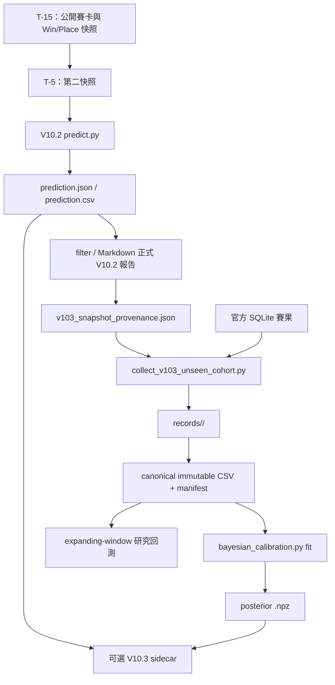

# V10.2 → V10.3 Bayesian 校準層資料串接深入審查

**審查日期：** 2026-08-18（HKT）
**審查範圍：** `pre_race_scheduler.py`、`collect_v103_unseen_cohort.py`、`bayesian_calibration.py`、`backtest_v10_3.py`、`filter_high_probability.py`，以及對應契約測試。
**版本狀態：** V10.2 為正式生產預測；V10.3 為並列式研究披露。
**總體結論：** **V10.2 正式機率、排序、EV 與 Kelly 的非干擾保護有效；T-5 cohort 的事後 field／模型版本驗證亦強。** 但目前有一項 **P0 時間戳記可信度缺口**，以及三項 **P1 串接完整性問題**。在修正前，V10.3 應繼續限制為 `available_research_only`，不得把任何 sidecar 說成可用於正式盲測採納或即時風險結論。

> **審查結論先行：** 現有架構已避免 V10.3 直接改寫 V10.2，但尚未完全證明每份 T-5 prediction 實際在開跑前完成，也沒有在即時 sidecar 階段核對 posterior 模型與當前 `horse_model.pkl` 屬同一 SHA-256。這兩項資料鏈問題必須先處理。

---

## 1. 審查方法與測試證據

本審查採取靜態資料流追蹤、程式契約檢視及隔離回歸測試三個層次。重點不在重新評估模型準確度，而是確認資料由 V10.2 賽前預測到 V10.3 cohort、fit、sidecar 與回測時，是否仍保留來源、時間與模型版本的可證明性。

| 驗證項目 | 執行結果 | 結論 |
|---|---|---|
| `verify_v103_unseen_cohort.py` | 通過。 | 驗證 T-5 provenance、賽後欄位隔離、官方 field matching、去重與 model SHA-256 分桶。 |
| `verify_v103_bayesian_calibration.py` | 通過。 | 驗證 manifest canonical CSV、錯誤 base-model 拒絕、CSV 竄改拒絕、sidecar 守恆與 V10.2 原始工件不變。 |
| `verify_v103_bayesian_walk_forward.py` | 通過。 | 驗證完整賽日不重疊時間切分與 `NOT_ELIGIBLE` 資料不足閘門。 |
| `test_pre_race_automation.py` | 通過。 | 驗證 V10.2 賽前排程、雙策略與報告流程未被 V10.3 破壞。 |
| 既有三 fold 研究回測 | 164 場 test，`NOT_ELIGIBLE`。 | 統計結果沒有被錯誤採納為 V10.2 機率替換。 |

所有測試均為程式與資料契約驗證；它們不是新的投注績效或未見 cohort 採納證據。

---

## 2. 現行資料流與安全控制

### 2.1 已確認有效的資料鏈控制

| 串接段 | 已實作控制 | 審查結論 |
|---|---|---|
| V10.2 → 正式 prediction | `predict.py` 先完成，`filter_high_probability.py` 仍以 `predicted_win_probability`、Place、EV、Kelly 作正式篩選。 | **通過。** V10.3 不在 V10.2 計算路徑內。 |
| V10.2 → sidecar | scheduler 只在 V10.2 prediction 成功後才呼叫 V10.3；sidecar 失敗不會阻斷 filter／Markdown。 | **通過。** 故障降級符合生產保護原則。 |
| T-5 provenance | 保存模型 SHA-256、prediction SHA-256、官方排程開跑時間、來源類型及 `post_race_labels_included=False`。 | **部分通過。** 欄位完整，但實際生成時間的來源有 P0 缺口。 |
| provenance → cohort | collector 驗證 schema、來源類型、嚴格賽前時間、prediction hash、機率和、無賽後欄位、唯一頭馬和完整 horse-number field。 | **通過。** 對事後入庫的候選有強驗證。 |
| cohort → canonical CSV | 每個 model SHA-256 有獨立 record bucket、canonical CSV、CSV SHA-256、cohort fingerprint 與場數。 | **通過。** 不可混合重訓模型。 |
| canonical CSV → fit | CLI 強制 manifest、canonical 路徑／SHA-256、每列 `base_model_sha256` 和同一 `horse_model.pkl`。 | **通過。** 任意歷史 CSV、跨模型版本或 CSV 竄改均被拒絕。 |
| sidecar → 報告 | sidecar 與正式 prediction 分檔；報告文案固定聲明不替換 V10.2 機率、排序、EV 或 Kelly。 | **部分通過。** 非替換保護有效，但 sidecar 與當前 base model／prediction hash 綁定不足。 |
| 回測時間隔離 | `backtest_v10_3.py` 以完整賽日做 expanding window；同日不可跨 train／validation／test。 | **通過。** validation／test 不參與當 fold 的 NumPyro fit。 |

---

## 3. 欄位與身份映射審查

### 3.1 V10.2 prediction → cohort record → canonical CSV

| 概念 | V10.2 輸入欄位 | cohort record | canonical CSV | V10.3 使用方式 |
|---|---|---|---|---|
| 場內正式機率 | `predicted_win_probability` | `predicted_win_probability` | `race_normalized_probability` | `log(p_v102)` offset。 |
| LightGBM 成分 | `lightgbm_calibrated_probability` | 同名保存 | 同名保存 | 建立 component contrast。 |
| CatBoost 成分 | `catboost_calibrated_probability` | 同名保存 | 同名保存 | 建立 component contrast。 |
| 場次身份 | scheduler job date/course/no | `race_key`、date/course/no | date/course/no | 分組與完整賽日時間切分。 |
| 馬匹身份 | `horse_no`、`horse_name` | horse number 作 official field matching | horse name 作 row identity | CSV 同場馬名必須唯一。 |
| 官方頭馬 | 不存在於賽前 prediction | `actual_win`，只在 official result field matching 後加入 | `target_win` | 僅供 offline fit／評分。 |
| 基礎模型版本 | scheduler 計算 `horse_model.pkl` hash | `model_sha256` | `base_model_sha256` | fit 前重新驗證同一完整 SHA-256。 |

此映射大致正確。正式 V10.2 JSON 不含賽後 `target_win`，collector 也明確拒絕含 `finish_pos`、`winner`、`actual_win`、`payout` 等事後欄位的 prediction rows。

### 3.2 機率契約

V10.3 對 V10.2 baseline 的要求是每匹機率嚴格大於零、每場總和在 `1 ± 1e-6`。每次 posterior draw 重新以 stable softmax 場內正規化，並在 sidecar 和回測都檢查機率守恆。現有合約測試觀察到最大誤差為 `4.44e-16`，符合預期。

> P05／P95 是逐馬邊際 posterior 分位數，不需要橫向相加為 1；必須守恆的是每一完整 posterior draw，而不是各馬邊際分位數列。

---

## 4. 發現事項與風險分級

### P0 — provenance 的 `prediction_generated_hkt` 不是實際 prediction 完成時間

| 欄位 | 觀察 |
|---|---|
| 位置 | `pre_race_scheduler.py`：`process()` 把 minute-trigger 的 `now` 傳入 `execute_stage()`；在 prediction 完成後，provenance 直接把該值寫為 `prediction_generated_hkt`。 |
| 問題 | T-5 觸發時刻和 `prediction.json` 實際完成寫入時刻可能不同。賠率抓取可執行至 90 秒、prediction 可執行至 180 秒；極端情況下 prediction 可能在官方 scheduled start 後才完成，但 provenance 仍記為 T-5 minute 的較早時間。 |
| 影響 | collector 的「嚴格賽前」比較可能通過一份其實在開跑後完成的 prediction。這會破壞不可變未見 cohort 的核心時間證明，即使沒有直接改動 V10.2。 |
| 建議修正 | `run_command()` 記錄實際 `started_at_hkt`、`finished_at_hkt`；prediction 成功後取得實際完成時間。只有 `finished_at_hkt < scheduled_start_hkt` 才可寫入可收集 provenance；否則寫入明確 `late_prediction_not_eligible` 狀態，且 collector 必須拒絕。 |
| 驗收測試 | 模擬 T-5 任務在開跑後完成，確認不會產生可收集 provenance／canonical record。 |

### P1 — 即時 sidecar 沒有驗證 posterior model 與當前 V10.2 base model 屬同一版本

| 欄位 | 觀察 |
|---|---|
| 位置 | `bayesian_calibration.py` 的 `overlay_prediction()` 載入 `.npz` metadata，但不核對其中 `cohort_provenance.base_model_sha256`；`pre_race_scheduler.py` 也沒有傳入或核對當前 `horse_model.pkl`。 |
| 問題 | 月度重訓後，舊 `.npz` 仍可被套用於由新 `horse_model.pkl` 生成的 prediction。sidecar 會仍顯示 `available_research_only`。 |
| 影響 | V10.2 正式輸出不受影響，但 V10.3 不確定性披露可能建立在不相容的 base-model 分佈上，造成錯誤風險訊號。 |
| 建議修正 | sidecar CLI 新增 `--base-model`；實時計算其 SHA-256，與 posterior metadata 已驗證的 `cohort_provenance.base_model_sha256` 比較。缺失、`unverified_exploratory_direct_api` 或不一致時，輸出 `unavailable_base_model_mismatch`，不可為 `available_research_only`。scheduler 必須傳入目前 `horse_model.pkl`。 |
| 驗收測試 | 以兩個不同 fixture model hash 產生 posterior／prediction；確認 mismatch 只可輸出 unavailable sidecar。 |

### P1 — component 缺失時的「中性」註解與實際 contrast 不一致

| 欄位 | 觀察 |
|---|---|
| 位置 | `bayesian_calibration.py`：`normalize_component()` 缺失時返回零向量；其後仍計算 `component_delta = lgb - cat`。 |
| 問題 | 若 CatBoost 欄位缺失但 LightGBM 完整，結果是 `delta = normalized_lgb - 0`，並非註解所述的「neutral zero contrast」。同理，部分馬匹 component 缺失會使整個 component 向量歸零，另一個 component 仍保留非零對比。 |
| 影響 | 不完整 component 資料可被錯誤解讀為模型分歧，影響 posterior P05／P95、entropy 和首選穩定度。 |
| 建議修正 | 只要任一 component 在同一完整 field 有缺失、負值、非有限值或總和不合法，整場 `component_delta` 必須直接為零；sidecar 額外輸出 `component_delta_status=unavailable_neutralized`。 |
| 驗收測試 | 測試完整、全缺失、單一 component 全缺失和單列缺失四種場景，均驗證不完整場只產生全零 contrast。 |

### P1 — cohort 自動評估仍呼叫舊 validator，而非目前 NumPyro `backtest_v10_3.py`

| 欄位 | 觀察 |
|---|---|
| 位置 | `collect_v103_unseen_cohort.py` 的 `run_walk_forward()` 呼叫 `walk_forward_v103_bayesian_uncertainty.py`。 |
| 問題 | cohort 達 325 場後的日常自動評估將執行早期 walk-forward validator，而非目前採用 NumPyro SVI、Brier／log score、3-fold 採納閘門的 `backtest_v10_3.py`。 |
| 影響 | 自動化評估與目前 V10.3 實作／文件／盲測口徑不一致。由於結果仍不會自動替換 V10.2，屬研究管線一致性風險，而不是生產替換風險。 |
| 建議修正 | 將 cohort orchestrator 改為呼叫一個 provenance-aware `backtest_v10_3.py` 模式，並要求 manifest、canonical CSV 和 base model SHA-256。報告 metadata 應明確標注 `verified_immutable_unseen_cohort`。 |
| 驗收測試 | fixture cohort 達縮小門檻時，驗證命令、輸出 schema 和 gate 均來自 NumPyro backtest，而不是舊 temperature validator。 |

### P2 — 報告渲染器不會核對 sidecar 的 source prediction hash

`filter_high_probability.py` 目前只檢查 `formal_probability_replacement is False`。sidecar 已包含 `source_prediction_sha256`，但 filter 不會把它與正在渲染的 prediction SHA-256 比較。scheduler 的同一輸出目錄和成功狀態檢查降低了日常風險，但手動呼叫或錯誤檔案路徑仍可把舊 sidecar 披露於新 prediction 報告。

**建議：** `load_v103_bayesian_disclosure()` 接收 prediction path／hash；不相符時回傳 `unavailable_source_prediction_mismatch`，並維持 V10.2 報告。

### P2 — V10.3 回測被正確標為研究性，但不驗證 immutable cohort

`backtest_v10_3.py` 接受任意保存的 V10.2 CSV，並以 `frozen_v102_artifact_only=True` 標示結果。完整賽日 split 和 train／validation／test 隔離正確，但該模式不檢查 T-5 provenance 或同一 base model SHA-256。因此，164 場結果只能作研究性敏感度觀察，不能視為正式 cohort 採納。

**建議：** 保留現有 `--predictions` 研究模式，但新增 `--cohort-manifest --base-model` 正式模式，復用 `validate_cohort_provenance()`；輸出應清楚區分 `research_artifact_only` 與 `verified_immutable_unseen_cohort`。

### P2 — 可設定的 snapshot minutes 與實際終止條件不完全一致

`pre_race_scheduler.py` 接受一般 `snapshot_minutes_before` 陣列，但取賽卡與觸發正式 prediction 的條件仍使用 `DEFAULT_SNAPSHOT_MINUTES=(15,5)`。在非預設設定（例如 `[20, 10]`）下，程式可排程快照但不一定在最小 configured offset 執行正式 prediction。

**建議：** 將 `execute_stage()` 的初始／最終 stage 判斷改為由實際 configured offsets 傳入，而不是模組常數。正式部署目前固定 `[15,5]`，故屬配置可擴展性問題。

---

## 5. 採納狀態與修正優先序

| 優先序 | 行動 | 對 V10.2 的影響 | 完成前的政策 |
|---|---|---|---|
| P0 | 寫入 prediction 實際完成時間，拒絕開跑後完成的 provenance。 | 無；只影響 V10.3 cohort 資格。 | 不得稱 T-5 cohort 為嚴格賽前盲測。 |
| P1 | sidecar 核對 posterior base model SHA-256 與當前 `horse_model.pkl`。 | 無；失配時只隱藏 V10.3 披露。 | 月度重訓後禁止沿用舊 posterior sidecar。 |
| P1 | component 缺失時全場中性化。 | 無；只修正 V10.3 posterior input。 | 不完整 component 欄位不應輸出研究性分歧。 |
| P1 | cohort auto-evaluation 改接 NumPyro provenance-aware backtest。 | 無；只修正研究評估工作。 | 325 場前後均不得以舊 validator 作新 Bayesian 採納結論。 |
| P2 | report 核對 source prediction SHA-256。 | 無；只提高披露配對可靠性。 | 手動報告使用須確認 sidecar 同源。 |
| P2 | 回測新增 manifest 模式。 | 無；保留既有研究模式。 | 現有 164 場結果只屬 research artifact。 |
| P2 | 使用實際 configured offsets。 | 無；提高未來設定可靠性。 | 部署維持 `[15,5]`。 |

---

## 6. 最終審查結論

V10.2 的生產邊界目前保持良好：Bayesian 模組不載入、重算或覆寫 V10.2 的 feature engineering、集成勝率、Place、EV、Kelly 或篩選。T-5 provenance、官方 result field matching、模型 SHA-256 分桶、canonical CSV 雜湊和 fit 前的 manifest 驗證均為可靠的設計基礎。

不過，V10.3 要成為可信的「不可變未見 cohort」研究鏈，仍必須先修正 **prediction 實際完成時間**與**即時 posterior／base-model 版本配對**。在 P0 與 P1 修正和新契約測試通過之前，所有 V10.3 sidecar 應被視為實驗性輔助披露，而不是具時間可證明性的盲測輸入。現行 `NOT_ELIGIBLE` 結論維持不變；不得由本審查或任何現有回測觸發 V10.2 機率替換。
