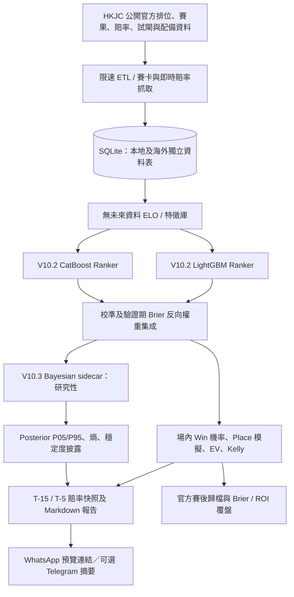

# 香港賽馬 V10 完整系統手冊

**系統名稱：** HKJC Racing ML V10
**正式生產版本：** V10.2 Advanced Feature & Ensemble Edition
**平行研究版本：** V10.3 Bayesian Calibration／Uncertainty Overlay
**主儲存庫：** [`zendog968-ai/hkjc-ml-v10`](https://github.com/zendog968-ai/hkjc-ml-v10)（私人）
**更新日期：** 2026-08-18（HKT）
**適用環境：** 具 Python、SQLite、Linux Cron 與持續網絡連線的受控 Linux 主機。

> **核心原則：** V10.2 是唯一的正式預測系統。V10.3 只提供並列式不確定性披露與離線校準研究；在不可變未見 cohort、時間外回測及人工版本審核全部達標前，V10.3 **不得**取代 V10.2 的勝率、排序、EV、Kelly 或任何篩選門檻。

> **負責任使用聲明：** 本系統基於香港賽馬會公開資料進行研究性建模及風險披露，並不構成投注指示、投資建議或任何回報保證。臨場撤回、場地、步速、獸醫資訊、騎師更換及市場變動均可令結果偏離模型。任何輸出均應以香港賽馬會最終公布資料為準。[1] [2]

---

## 目錄

1. [系統定位與版本邊界](#1-系統定位與版本邊界)
2. [架構總覽](#2-架構總覽)
3. [資料來源、覆蓋度與資料庫](#3-資料來源覆蓋度與資料庫)
4. [V10.2 特徵工程與模型](#4-v102-特徵工程與模型)
5. [正式模型績效與正確解讀](#5-正式模型績效與正確解讀)
6. [本地賽事日常賽前流程](#6-本地賽事日常賽前流程)
7. [輸出欄位、Win／Place、EV 與 Kelly](#7-輸出欄位winplaceev-與-kelly)
8. [不確定性、亂局與馬膽使用邊界](#8-不確定性亂局與馬膽使用邊界)
9. [賽後歸檔與覆盤](#9-賽後歸檔與覆盤)
10. [海外 S1／S2 轉播賽](#10-海外-s1s2-轉播賽)
11. [複合彩池與孖 T 研究](#11-複合彩池與孖-t-研究)
12. [V10.3 Bayesian 平行研究層](#12-v103-bayesian-平行研究層)
13. [自動化排程與主機運維](#13-自動化排程與主機運維)
14. [部署、更新、測試與 Git 管理](#14-部署更新測試與-git-管理)
15. [常見問題與故障處理](#15-常見問題與故障處理)
16. [操作檢查清單](#16-操作檢查清單)
17. [參考資料](#17-參考資料)

---

## 1. 系統定位與版本邊界

V10 的目標並非預言單場賽果，而是把可驗證的賽前公開資料整理成場內相對機率、資料品質警示、公開市場比較及可稽核的歷史評估。系統以每場所有參賽馬的機率總和為 100% 為基本契約，避免把不同場次的絕對分數錯作同一尺度的勝率。

| 層級 | 版本／狀態 | 可做事項 | 不可做事項 |
|---|---|---|---|
| 正式預測層 | **V10.2** | LightGBM + CatBoost 集成勝率、Plackett–Luce Place 機率、公開 Win／Place 賠率比較、EV、quarter-Kelly、賽前報告與賽後覆盤。 | 不自動下注、不自動發送 WhatsApp 或 Telegram。 |
| 風險披露層 | **P0 uncertainty reporting** | 顯示 `top2_gap`、正規化 entropy、模型分歧及低分離度警示。 | 不改寫正式機率或單膽門檻。 |
| 研究覆蓋層 | **V10.3** | NumPyro Bayesian sidecar、posterior mean、P05／P95、首選穩定度與 entropy。 | 不替代 V10.2 排名、機率、EV、Kelly 或雙策略篩選。 |
| 海外模組 | **V10.2 S1/S2** | 海外冷啟動先驗、RPR／IFHA、場地／遠征訊號及官方來源覆盤。 | 不把香港本地 ELO 強行套用為海外馬匹實力。 |
| 複合彩池研究 | **三重彩、六環彩、孖 T** | 讀取已保存的池資料，作策略壓力測試、EV 及回撤研究。 | 不把資料缺口、未結算派彩或事後資訊當作可交易訊號。 |

---

## 2. 架構總覽



正式生產鏈必須先完成 V10.2。V10.3 只可於 V10.2 `prediction.json` 已安全落盤後讀取副本產生 sidecar；若 V10.3 沒有 posterior 模型、資料契約不符或推論失敗，賽前排程必須照常輸出 V10.2 報告。

---

## 3. 資料來源、覆蓋度與資料庫

### 3.1 官方來源與讀取原則

本地賽事資料來自香港賽馬會公開的賽期表、所有場次賽果、單場賽果、排位表、馬匹資料、試閘及公開賠率頁。抓取器採單一工作執行緒、隨機延遲、定期冷卻與可續跑寫入；遇到 HTTP 403、429 或來源結構異常時，系統停止或降級，不會嘗試繞過存取限制。[1] [2] [3]

| 資料來源 | 用途 | 重要限制 |
|---|---|---|
| 賽期表 | 識別官方賽日與馬場。 | 賽期表帶圖示的日期仍須以結果頁核實。 |
| 所有場次賽果 | 核實實際場次與取消／無效場。 | 不把「沒有相關資料」當作已完成賽日。 |
| 單場賽果 | 寫入名次、時間、馬位、騎練、負磅、檔位、最終獨贏資料。 | 只以已完成、可識別唯一頭馬的場次構成勝負樣本。 |
| 排位與公開賠率 | 建立賽前賽卡、T-15／T-5 Win／Place 快照。 | 缺值、SCR、逾時或頁面變動時須保留未知狀態。 |
| 馬匹／試閘／配備頁 | 新馬先驗與裝備變動。 | 沒有結構化官方資料時回歸中性，而不是從文字評語臆測。 |

### 3.2 本地三季資料覆蓋

目前正式 V10.2 資料庫覆蓋 2023/24、2024/25 與 2025/26 三個完整香港本地馬季，資料截止至 2026-07-15。

| 馬季 | 正式賽日 | 場次紀錄 | 已完成場次 | 取消／無效 | 馬匹出賽紀錄 |
|---|---:|---:|---:|---:|---:|
| 2023/24 | 89 | 841 | 831 | 10 | 10,082 |
| 2024/25 | 88 | 850 | 847 | 3 | 10,476 |
| 2025/26 | 88 | 868 | 865 | 3 | 10,947 |
| **合計** | **265** | **2,559** | **2,543** | **16** | **31,505** |

特徵工程產出 29,872 筆無未來資料的賽前特徵列，覆蓋 2,437 場正式賽事、2,361 匹馬及 54 名騎師。取消或無效場次保留作稽核，但不會進入模型訓練或機率評分。

### 3.3 SQLite 主要表格

| 表格／範圍 | 用途 | 重要欄位或控制 |
|---|---|---|
| `meetings`、`races`、`starters` | 本地官方賽日、場次與逐馬紀錄。 | `race_status`、路程、場地、馬號、名次、時間、馬位、騎練與最終賠率。 |
| `elo_feature_store` | 無未來資料的賽前特徵庫。 | 每列只能使用該場開跑前已知歷史。 |
| `horse_new_horse_priors`、`starter_equipment` | 新馬先驗及官方配備稽核。 | 未知值與中性值分開處理。 |
| `odds_snapshots` 與賽前 archive | T-15／T-5 公開 Win／Place 快照。 | 歷史快照不完整時不得倒灌進訓練。 |
| `overseas_*` 表格 | 海外轉播賽發現、賽卡、預測、快照與官方歸檔。 | 與本地表格隔離；`partial` 不得誤稱完整。 |

大型 SQLite、`horse_model.pkl`、即時快照、日誌、日常 prediction JSON／CSV 及環境憑證均應排除於 Git。

---

## 4. V10.2 特徵工程與模型

### 4.1 無未來資料規則

V10.2 的每一筆訓練或回測列，必須只使用該場開跑前可得的歷史資料。任何同場賽果、之後的名次、完成時間、最後派彩或未來賠率均不可進入該列特徵。回測須按賽日時間序列切分，而非隨機混合資料。

| 特徵群組 | 代表欄位 | 處理原則 |
|---|---|---|
| 馬匹／騎師 ELO | horse、jockey、同程同場 ELO。 | 只在賽後更新，下一場才可使用。 |
| 近績與走勢代理 | 近六仗名次、馬位差、`closing400_proxy`。 | 末段代理不是儀器量度的單駒 400 米分段。 |
| 場景適性 | 馬場、路程、草／泥地、跑道欄位、going、檔位偏差。 | 小樣本以 shrinkage 拉回全體平均，避免極端跑道偏差。 |
| 班磅與體重 | 負磅變化、班次、馬體重及變幅。 | 體重未知不當作零變幅；絕對變幅大於 15 磅另行標記。 |
| 騎練與裝備 | 騎師／馬房平滑勝率、首次眼罩、新增或改變配備。 | 配備只用當場已公布及之前歷史。 |
| 新馬先驗 | 血統路程匹配、結構化試閘、冷啟動先驗。 | 官方資料不完整時使用中性值與 unknown flag。 |
| 市場審計 | T-15／T-5 變化、`odds_drop_ratio`。 | 只作即時報告與審計；不把不完整歷史快照當訓練標籤。 |

### 4.2 集成訓練與校準

`train_lightgbm.py` 同時訓練 LightGBM Ranker 與 CatBoost Ranker。資料以賽日時間序列分為 70% 訓練、15% 驗證與最後 15% 測試。兩個模型各自校準後，以驗證期場內 Brier score 的倒數計算集成權重；目前集成權重接近均衡，LightGBM 為 49.92%，CatBoost 為 50.08%。

```bash
cd /home/ubuntu/hkjc_v10_database

python3 build_elo_features.py \
  --db hkjc_last_season.sqlite \
  --report v102_feature_report.json

python3 train_lightgbm.py \
  --db hkjc_last_season.sqlite \
  --model horse_model.pkl \
  --report v102_training_report.json \
  --predictions v102_multiseason_backtest_predictions.csv
```

`horse_model.pkl` 是 V10.2 正式模型工件。任何月度重訓都會改變其 SHA-256；V10.3 未見 cohort 必須依此完整 SHA-256 隔離，絕不可跨模型版本混合。

---

## 5. 正式模型績效與正確解讀

最新三季時間外測試使用 385 場，結果如下。這些是歷史研究指標，用於衡量排序及機率校準，**不能推論未來勝率、ROI 或保證回報**。

| 指標 | V10.2 集成結果 | 解讀 |
|---|---:|---|
| 測試場次 | 385 | 以最後時間區間作歷史測試。 |
| Top-1 勝出率 | 22.60% | 每場模型首選實際勝出的比例。 |
| Top-3 包含頭馬比率 | 48.31% | 頭馬是否包含於模型前三名。 |
| 場內平均 Brier score | 0.8781 | 越低代表場內機率與結果的校準較佳。 |
| 等機會基準 Brier score | 0.9185 | V10.2 歷史上低於等機會基準。 |

Brier score 衡量的是整個場內機率向量，而非只看首選有否勝出。單場結果的隨機性很高；少於 15 場的任何局部樣本必須標示為**探索性**，不可視作穩定績效證據。

---

## 6. 本地賽事日常賽前流程

### 6.1 賽日開始前：核對官方開跑時間與賽卡

所有賽日操作均應先由香港賽馬會最新排位表及賽程核對馬場、場次、開跑時間、撤回馬、場地與配備。`pre_race_schedule.json` 內開跑時間屬可稽核輸入，不應由程式猜測。

```json
{
  "timezone": "Asia/Hong_Kong",
  "snapshot_minutes_before": [15, 5],
  "meeting": {
    "race_date": "YYYY/MM/DD",
    "racecourse": "ST",
    "race_start_times": {
      "1": "13:00",
      "2": "13:35"
    }
  }
}
```

若需手動單場操作，可先建立官方賽卡，再抓取公開賠率並執行預測。

```bash
cd /home/ubuntu/hkjc_v10_database

python3 fetch_hkjc_racecard.py \
  --date YYYY/MM/DD --racecourse ST --race-no 3 \
  --output race_card.json

python3 fetch_hkjc_live_odds.py \
  --race-card race_card.json \
  --combined-output odds_overlay_combined.json

python3 predict.py \
  --db hkjc_last_season.sqlite \
  --model horse_model.pkl \
  --race-card race_card.json \
  --win-odds-overlay odds_overlay.json \
  --place-odds-overlay place_odds_overlay.json \
  --output-json prediction.json \
  --output-csv prediction.csv
```

### 6.2 正式 T-15／T-5 自動化

`pre_race_scheduler.py` 是正式賽前工作流。它在 T-15 保存第一個公開 Win／Place 快照，在 T-5 再保存第二個快照，然後執行 V10.2 預測、雙策略篩選、報告生成與 V10.3 sidecar（如可用）。

| 時點 | 工件 | 用途 |
|---|---|---|
| T-15 | `odds_t_minus_15.json` | 保留第一個公開市場狀態。 |
| T-5 | `odds_t_minus_5.json`、`prediction.json` | 比較落飛、執行正式 V10.2 預測。 |
| T-5 後 | `v103_snapshot_provenance.json` | 封存模型 SHA-256、prediction SHA-256、產生時間及無賽後標籤聲明，供 V10.3 cohort 使用。 |
| 報告 | `pre_race_report.md`、`high_probability_filter.json` | 顯示正式機率、資料警示、公開市場比較與 WhatsApp 預覽連結。 |

每分鐘 Cron 只負責喚醒排程器；排程器自身以鎖與狀態檔保證同一場次不會重複觸發。GitHub Actions 賽前掃描只可作備援或約一小時前報告，不能取代需要精確時間的主機 T-15／T-5 快照。

```bash
python3 pre_race_scheduler.py \
  --config pre_race_schedule.json \
  --project-dir . \
  --now 2026-09-06T12:45:00+08:00 \
  --dry-run
```

### 6.3 賽前輸出位置

```text
runtime/pre_race/YYYY/MM/DD_ST_R03/
├── race_card.json
├── odds_t_minus_15.json
├── odds_t_minus_5.json
├── odds_overlay.json / place_odds_overlay.json
├── prediction.json / prediction.csv
├── high_probability_filter.json
├── pre_race_report.md
├── v103_snapshot_provenance.json
└── racecard.log / odds.log / predict.log / filter.log
```

若 `odds_overlay.meta.json` 顯示 `degraded`，表示公開頁出現空值、SCR、逾時或結構變動。V10.2 可繼續輸出賽前機率，但受影響馬匹的 EV 應為 `null`，Kelly 為 `0`；不得把缺失值誤解為市場訊號。

---

## 7. 輸出欄位、Win／Place、EV 與 Kelly

### 7.1 機率與模型欄位

| 欄位 | 定義 | 使用限制 |
|---|---|---|
| `predicted_win_probability` | V10.2 集成後、場內正規化且合計為 1 的正式勝出機率。 | 正式輸出；不等於保證勝出。 |
| `predicted_place_probability` | 以集成勝出強度透過 Plackett–Luce 模擬得出的入位機率。 | 取決於場內馬數與模擬設定。 |
| `model_heat_index` | 相對場內平均機會的熱度；100 為平均。 | 不是市場人氣。 |
| `horse_elo`、`jockey_elo` | 截至當場前的相對評分。 | 新馬或樣本少時需配合 `data_warning`。 |
| `closing400_proxy` | 由官方結果欄位推導的末段走勢代理。 | 不是實測個別馬匹 400 米時間。 |
| `odds_drop_ratio` | `(T-5 Win odds − T-15 Win odds) / T-15 Win odds`。 | 僅代表公開賠率變動。 |
| `data_warning` | 樣本、欄位或市場資料不足警示。 | 應降低結論強度，而不是填補猜測數值。 |

### 7.2 EV 與市場隱含機率

香港賽馬會顯示的 Win／Place 賠率以 decimal odds 處理時，市場隱含機率為 `1 / odds`，每單位期望值為：

```text
EV = 模型機率 × decimal odds − 1
```

EV 大於零只表示在模型機率、指定時點賠率及 decimal-odds 假設下的數學比較為正；它不處理模型誤差、臨場變動、流動性或長期保證。未有同時點公開賠率時，EV 應留空，不可用過期賠率替代。

### 7.3 Kelly

原始 Kelly 比例為：

```text
Kelly = max(0, (p × odds − 1) / (odds − 1))
```

V10.2 報告採保守 **quarter-Kelly** 表示，即 `0.25 × Kelly`。若賠率缺失、賠率不大於 1、機率或市場資料不合法，Kelly 必須輸出 `0`。Kelly 是風險分配的數學函數，不是下注命令。

### 7.4 雙策略篩選與 WhatsApp 預覽

| 策略 | 條件 | 報告行為 |
|---|---|---|
| 熱門穩攻 | Win 機率 ≥ 10% **或** Place 機率 ≥ 85%。 | Place ≥ 90% 會標示「超級焦點」。 |
| 冷門突襲／Value Bomb | Win odds ≥ 10、Place odds ≥ 3.5、Win 機率 ≥ 8%、Place 機率 ≥ 80%。 | 只在全部條件同時成立時顯示。 |
| 閘前資金落飛 | `odds_drop_ratio ≤ -20%`。 | 顯示 `🔥 閘前資金落飛`；不代表內幕消息。 |

`filter_high_probability.py` 只生成前往 `+85296896832` 的 WhatsApp 預覽連結；使用者必須自行點擊、覆核和決定是否發送。系統不會自動發送訊息。

---

## 8. 不確定性、亂局與馬膽使用邊界

V10.2 的 P0 不確定性層不會改變機率，只會披露分佈狀態。當 `top2_gap` 很小、正規化 entropy 高、模型 component 分歧或首選之外的頭馬排名風險升高時，報告應標示低分離度或亂局警示。

| 場內情況 | 報告含義 | 操作邊界 |
|---|---|---|
| 首二差距小、entropy 高 | 兩匹或多匹馬的模型機會接近。 | 不宜把單一首選描述為高確定性馬膽。 |
| 14 匹或以上且首選 Win < 20% | `⚠️ 高爆冷風險亂局`。 | 海外報告明確不建議單一熱門作單膽。 |
| Place ≥ 90% 但資料警示高 | 機率門檻已達，但資料可靠性不足。 | 必須同時展示資料警示，不能只看數字。 |
| 小樣本少於 15 場 | 統計不穩定。 | 所有局部結論標示為探索性。 |

系統可協助把正式 V10.2 首選列為研究性「單式馬膽候選」，但不應以馬膽名稱掩蓋樣本警示或市場不確定性。最終任何決策應以官方最後排位、撤回、場地與賠率為準。

---

## 9. 賽後歸檔與覆盤

`auto_archive_results.py` 與 `post_race_audit.py` 形成「賽前快照 → 官方賽果 → 稽核報告」的閉環。歸檔與是否曾產生預測無關：沒有賽前預測的賽事仍須寫入官方賽果；有賽前預測才可進行模型命中與 ROI 覆盤。

### 9.1 賽後流程

```bash
python3 auto_archive_results.py \
  --date YYYY-MM-DD \
  --db hkjc_last_season.sqlite \
  --schema schema_overseas_racing.sql \
  --archive-dir archive/result_archive_runs
```

| 覆盤控制 | 作用 |
|---|---|
| 正規化馬號與 field matching | 比對預測與官方結果前，統一馬號型態並確保同一完整 field。 |
| 機率守恆 | 只有預測場內機率合計符合容差時，才計算 field Brier。 |
| 唯一頭馬 | 官方結果必須有唯一、可識別的頭馬。 |
| `archived_only` | 沒有賽前預測時只保存官方結果，不生成虛構模型表現。 |
| 最終 odds／派彩 | Win ROI 以官方最終可用資料結算；Place 派彩未正規化時維持 `N/A`。 |

### 9.2 覆盤指標

賽後報告可追蹤 Top-1、Top-3、雙策略命中、落飛標記表現、場內 Brier、策略研究籃子 Win ROI 及資料完整性。ROI 僅屬歷史策略研究，不得把單日或小樣本報告當作未來保證。

若主機已以安全環境變數設定 `TELEGRAM_BOT_TOKEN` 和 `TELEGRAM_CHAT_ID`，覆盤摘要可推送至 Telegram；未設定時必須安全降級為 `telegram_not_configured`，不得在日誌、Markdown、SQLite 或 Git 寫入憑證。

---

## 10. 海外 S1/S2 轉播賽

### 10.1 資料回刷與完整性

海外資料與本地資料隔離。系統以 HKJC 海外 fixture 建立發現清單，再以可續跑方式解析官方來源。`discovered`、`partial`、`source_unavailable` 與 `complete` 是不同狀態；發現群組數不等於完整賽果資料量。

截至 2026-08-17，官方 fixture 發現 268 個海外轉播群組；此數字只是可恢復的官方發現清單，不可描述為 2023–2026 全量賽果已完成。任何缺口必須保留並使用 `--resume` 重新嘗試，不能以第三方資料、推測名次或替代賠率補洞。

```bash
python3 backfill_overseas_2023_2026.py \
  --db hkjc_last_season.sqlite \
  --schema schema_overseas_racing.sql \
  --start-date 2023-01-01 --end-date 2026-08-17 \
  --resume \
  --delay-min 3.0 --delay-max 6.0 \
  --cooldown-every 20 --cooldown-seconds 60 \
  --report-dir overseas_backfill_reports/run_$(date +%F)
```

### 10.2 S1/S2 賽前預測

`fetch_hkjc_s1s2.py` 讀取公開排位與可用賠率；`predict_s1s2.py` 以海外冷啟動機制處理無香港 ELO 的馬匹。可驗證資料包括 RPR／IFHA、久休、場地適應、練馬師 G1、T-15／T-5 落飛、場內相對負磅及近期前四的縮減訊號。賠率缺失時只輸出場內相對機率，不計算 EV 或 Kelly。

```bash
python3 fetch_hkjc_s1s2.py \
  --date YYYY-MM-DD --simulcast-code S1 --race-no 9 \
  --snapshot-label T_MINUS_15 \
  --scheduled-start-utc YYYY-MM-DDTHH:MM:SS+00:00 \
  --output runtime/s1_9_t15.json

python3 predict_s1s2.py \
  --db hkjc_last_season.sqlite \
  --race-card runtime/s1_9_t15.json \
  --output-json runtime/s1_9_prediction.json \
  --output-md runtime/s1_9_prediction.md
```

海外報告的高爆冷與高 EV 標籤只能按已驗證條件生成。賽場有效參戰馬不少於 14 匹且首選勝率低於 20% 時，報告應發出高爆冷亂局警示；獨贏賠率大於 15、輕磅或內檔、且模型 EV 為正時才可顯示「高 EV 冷門」。

---

## 11. 複合彩池與孖 T 研究

V10.2 可擴充三重彩、六環彩及孖 T 的快照 schema、EV 查詢與回測。這些功能屬資料庫研究工具，必須使用保存於預測時點的池資料、組合、成本與官方結算結果。

| 模組 | 主要用途 | 稽核原則 |
|---|---|---|
| 複合彩池快照 schema | 保存組合、時間、賠率／派彩與來源。 | 不覆蓋舊快照；明確區分預測時點與結算時點。 |
| `query_complex_pool_ev.py` | 三重彩／六寶獎 EV 查詢範例。 | 缺少完整派彩或組合資料時輸出 `N/A`。 |
| 三重彩批量回測 | 聚合歷史策略 ROI。 | 以同一時點快照和結算資料結算，避免賽後選擇偏差。 |
| 孖 T 壓力測試 | 跨季度 ROI、回撤及資料充足性報告。 | 資料不足時輸出 N/A 閘門，不以估算補洞。 |

每週一 09:00 HKT 的孖 T 壓力測試如已在主機安裝，必須保持與月度模型重訓及日常 archive 任務相互獨立，並將每週報告與原始快照存檔。

---

## 12. V10.3 Bayesian 平行研究層

### 12.1 目的與公式

V10.3 是一個不接觸 V10.2 正式邏輯的 NumPyro AutoNormal SVI 部分池化 categorical offset 覆蓋層。它把已保存的 V10.2 場內機率 `p_v102` 及 V10.2 的賽前 LightGBM／CatBoost component 差異作為輸入：

```text
s_ri = α × log(p_v102,ri) + β_course[r] × δ_component,ri
q_ri = softmax(s_ri)
```

輸出 `posterior_win_mean`、P05／P95、`top1_rank_stability`、posterior entropy 和 component sensitivity。所有輸出都只存在於獨立 sidecar JSON；`prediction.json` 保持只讀。

### 12.2 不可變未見 cohort

T-5 完成後，`pre_race_scheduler.py` 會寫入 `v103_snapshot_provenance.json`。`collect_v103_unseen_cohort.py` 只有在下列條件全部通過後，才會把賽事封存為 V10.3 cohort record：

| 檢查 | 必要條件 |
|---|---|
| 來源 | 必須是 T-5 scheduler 產生的 provenance schema。 |
| 時間 | prediction 產生時間必須嚴格早於官方預定開跑時間。 |
| 原始預測 | prediction SHA-256 與 provenance 完全相符，且沒有賽後欄位。 |
| 模型 | `horse_model.pkl` 的完整 SHA-256 合法，並作獨立 bucket。 |
| 官方結果 | 結果已入庫、有唯一頭馬，且官方 field 與預測 field 完整匹配。 |
| 冪等性 | 同一 race／同一預測 SHA-256 不重複寫入；來源不同時保留衝突。 |

150 場同模型 cohort 只代表**監測門檻**；完整標準 expanding-window 設計為 100 場初始訓練加 3 組各 25 場 validation 和 50 場 test，故需要 325 場同模型、不可變、已結算的記錄。

### 12.3 Provenance 強制 fit

`bayesian_calibration.py fit` 只能使用 collector manifest 登記的 canonical CSV，並需同時提供原始 `horse_model.pkl`。開始 SVI 前，程式重新驗證 manifest schema、canonical CSV 路徑及 SHA-256、每列 `base_model_sha256`、cohort fingerprint、賽事計數及 base model 完整 SHA-256。任何跨重訓版本、複製 CSV、竄改內容或模型錯配均會拒絕 fit。

```bash
MODEL_SHA="$(sha256sum horse_model.pkl | awk '{print $1}')"
python3 bayesian_calibration.py fit \
  --predictions archive/v103_bayesian_cohort/canonical_training/${MODEL_SHA:0:16}/v103_immutable_unseen_cohort.csv \
  --cohort-manifest archive/v103_bayesian_cohort/manifest_latest.json \
  --base-model horse_model.pkl \
  --output-model models/v103_bayesian_calibration.npz \
  --advi-steps 10000 --posterior-draws 400 --seed 10301
```

### 12.4 採納閘門與目前結論

| 閘門 | 最低要求 | 未達標行為 |
|---|---|---|
| 未見 test 覆蓋 | 3 folds、至少 150 場。 | `insufficient_data`／`NOT_ELIGIBLE`。 |
| 整體 Brier | overlay 比 V10.2 control 改善至少 0.005。 | 禁止替換。 |
| Fold Brier | 至少 2/3 folds 改善至少 0.005。 | 禁止替換。 |
| Log score | 至少 2/3 folds 不惡化。 | 禁止替換。 |
| 場內守恆 | 所有 posterior draws 均通過。 | 禁止替換。 |
| 結論 | 即使全部通過也只可 `REVIEW_REQUIRED`。 | 須人工審核並建立獨立 V10.3-B。 |

以保存的 V10.2 歷史工件進行的三 fold研究性盲測共有 164 場 test，整體 Brier delta 為 **+0.000240**，只有 0/3 folds 達 Brier 改善門檻，且只有 1/3 folds 的 log score 不惡化。因此目前狀態為 **`NOT_ELIGIBLE`**。該 164 場是 `frozen_v102_artifact_only` 研究結果，並非同一 T-5 immutable model cohort 的正式採納證據。

---

## 13. 自動化排程與主機運維

下表列出目前系統可使用或已部署的節奏。所有時間均為香港時間；實際 crontab 應只由對應的安全安裝器管理其標記區段，避免覆蓋其他主機工作。

| 時間 | 工作 | 封鎖／安全機制 | 主要輸出 |
|---|---|---|---|
| 每分鐘 | 本地賽前 scheduler | 狀態檔與檔案鎖；只在 T-15／T-5 視窗觸發。 | 賽卡、快照、prediction、報告。 |
| 每月 1 日 02:00 | 資料庫增量、特徵重建與模型重訓。 | 不把模型或 DB 寫入 Git；重訓會建立新 V10.3 cohort bucket。 | 最新 DB、feature report、`horse_model.pkl`。 |
| 每日 03:15 | 官方賽果 archive 與海外 backfill。 | `runtime/daily_archive_and_backfill.lock`。 | 結果 archive、海外缺口／覆盤。 |
| 每日 04:30 | Git fast-forward sync 與確定性 code review。 | 先檢查 archive lock；`py_compile`、diff、secret scan、測試。 | review Markdown、日誌。 |
| 每日 05:10 | V10.3 unseen cohort 收集。 | 檢查 archive lock；`runtime/v103_bayesian_cohort.lock`。 | manifest、canonical CSV、cohort log。 |
| 每週一 09:00 | 孖 T 跨季度壓力測試（如已部署）。 | 獨立 archive 與 N/A 資料閘門。 | 壓力測試報告。 |

### 13.1 已安裝 V10.3 daily cohort Cron

目前主機的受管理 crontab 區段為：

```cron
# BEGIN HKJC_V10_3_BAYESIAN_COHORT
CRON_TZ=Asia/Hong_Kong
10 5 * * * /home/ubuntu/hkjc_v10_database/run_daily_v103_bayesian_cohort.sh
# END HKJC_V10_3_BAYESIAN_COHORT
```

檢查方式如下：

```bash
crontab -l
systemctl status cron
cat archive/v103_bayesian_cohort/manifest_latest.json
tail -n 100 archive/v103_bayesian_cohort/logs/$(TZ=Asia/Hong_Kong date +%F).log
```

---

## 14. 部署、更新、測試與 Git 管理

### 14.1 最小部署

```bash
sudo mkdir -p /opt/hkjc-v10 /var/log/hkjc-v10
sudo chown -R "$USER":"$USER" /opt/hkjc-v10 /var/log/hkjc-v10

git clone https://github.com/zendog968-ai/hkjc-ml-v10.git /opt/hkjc-v10
cd /opt/hkjc-v10

python3 -m venv .venv
. .venv/bin/activate
pip install --upgrade pip
pip install -r requirements.txt
python -m playwright install chromium
```

部署後需從可信任備份或私有 release 取得 `hkjc_last_season.sqlite` 與 `horse_model.pkl`。程式碼同步不應自動覆蓋生產資料庫、模型或 archive。

### 14.2 月度更新

```bash
cd /opt/hkjc-v10
. .venv/bin/activate

python3 monthly_update.py \
  --db hkjc_last_season.sqlite \
  --csv hkjc_last_season.csv \
  --end-date YYYY-MM-DD

python3 build_elo_features.py --db hkjc_last_season.sqlite
python3 train_lightgbm.py --db hkjc_last_season.sqlite --model horse_model.pkl
```

月度重訓完成後，必須重新確認模型 SHA-256，並把 V10.3 cohort 視為新的獨立群組。舊模型 cohort 不可與新模型 cohort 合併。

### 14.3 建議測試集

| 測試 | 驗證目的 |
|---|---|
| `python3 test_v102_advanced.py` | V10.2 集成與進階特徵。 |
| `python3 test_pre_race_automation.py` | 賽前排程、篩選及報告流程。 |
| `python3 verify_race_uncertainty_reporting.py` | P0 不確定性欄位與報告。 |
| `python3 verify_v103_unseen_cohort.py` | T-5 provenance、賽後隔離、field matching、模型隔離。 |
| `python3 verify_v103_bayesian_calibration.py` | V10.3 manifest／SHA-256、posterior 守恆、sidecar 不可變性。 |
| `python3 verify_v103_bayesian_walk_forward.py` | 時間切分、驗證／測試隔離與採納閘門。 |
| `python3 verify_overseas_archive_audit_guidance.py` | 海外官方解析、archive、Brier 與風險提示。 |

### 14.4 Git 分支規則

| 分支 | 用途 | 規則 |
|---|---|---|
| `main` | V10.2 已驗證正式程式。 | 只合併經測試、可回滾的正式變更。 |
| `feature/v10.3-bayesian-calibration` | V10.3 研究覆蓋層。 | 不得修改 V10.2 核心機率、特徵、EV 或 Kelly 邏輯。 |
| 私有 release／受控備份 | 大型模型、DB、archive。 | 不提交大型二進位與敏感資料至一般 Git 歷史。 |

截至本手冊日期，V10.3 功能分支包含 Bayesian overlay、cohort provenance 硬化與 JIT SVI 效能修正；`main` 未合併 V10.3。

---

## 15. 常見問題與故障處理

| 現象 | 可能原因 | 安全處理 |
|---|---|---|
| 賠率快照為 `degraded` | 公開頁空值、SCR、逾時或結構變動。 | 保留 V10.2 機率；EV 留空、Kelly 歸零；不要重覆高頻抓取。 |
| 報告沒有 EV | 未有同時點有效 Win／Place 賠率。 | 不用舊賠率補算；待公開資料恢復。 |
| 賽前 scheduler 沒觸發 | 開跑時間設定錯誤、過觸發窗、鎖仍存在或 state 已標記完成。 | 先用 `--dry-run --now`；核對官方開跑時間與 log。 |
| Brier audit 無法計算 | 預測與官方 field 不匹配、機率不守恆或沒有唯一頭馬。 | 保留拒絕原因；不以部分 field 計算。 |
| 海外回刷顯示 `partial` | 官方結果頁未有完整可解析名次。 | 保留狀態並 `--resume`；不得猜測或用第三方補洞。 |
| V10.3 fit 被拒絕 | CSV／manifest／base model SHA-256 不一致或並非 canonical CSV。 | 使用 collector 產生的 manifest 路徑和相同 `horse_model.pkl`；不要手動複製 CSV。 |
| V10.3 sidecar 不可用 | 沒有 posterior 模型或資料契約失敗。 | 這是設計上的安全降級；V10.2 正式報告必須繼續。 |
| Cron 沒有執行 | 服務未啟動、使用者 crontab 遺失或環境路徑錯誤。 | 檢查 `systemctl status cron`、`crontab -l`、日誌和絕對路徑。 |
| Telegram 無推送 | 未設定安全環境變數。 | 保持 `telegram_not_configured`；不把 token 寫入程式、報告或 Git。 |

---

## 16. 操作檢查清單

### 賽日前

| 檢查 | 完成條件 |
|---|---|
| 官方排位與開跑時間 | 已按 HKJC 最後公布更新賽日設定。 |
| 賽卡與撤回馬 | 已重抓或核對，馬號與馬名匹配。 |
| DB／模型存在 | `hkjc_last_season.sqlite` 與 `horse_model.pkl` 可讀。 |
| 快照排程 | T-15／T-5 schedule、鎖與日誌目錄可寫。 |
| 資料警示 | 知道新馬、少樣本、設備／體重未知的範圍。 |

### 開跑前

| 檢查 | 完成條件 |
|---|---|
| T-15 快照 | 已保存並含 metadata。 |
| T-5 快照 | 已保存，且與 T-15 為同場同 field。 |
| 正式 prediction | 場內 Win 機率總和為 1；Place、EV／Kelly 缺失時正確降級。 |
| 報告 | 顯示 P0 風險、不把低分離度誤說成確定性馬膽。 |
| V10.3 | 只檢視 sidecar 披露；絕不以 posterior mean 改正式欄位。 |

### 賽後

| 檢查 | 完成條件 |
|---|---|
| 官方賽果入庫 | 本地與海外已完成賽事均歸檔。 |
| 覆盤 | 有賽前預測才計算 Top-1／Top-3／Brier／策略研究結果。 |
| 無預測賽事 | 寫入 `archived_only`，不建立虛構比較。 |
| V10.3 cohort | 只接受 T-5 provenance、hash、時間與 field 全部通過的記錄。 |
| 日誌與備份 | archive、manifest、daily report 及 crontab backup 可追溯。 |

---

## 17. 參考資料

[1] [香港賽馬會：本地賽期表](https://racing.hkjc.com/zh-hk/local/information/fixture)
[2] [香港賽馬會：所有場次賽果](https://racing.hkjc.com/zh-hk/local/information/resultsall)
[3] [香港賽馬會：本地排位與單場資料](https://racing.hkjc.com/zh-hk/local/information/racecard)
[4] [香港賽馬會：海外轉播賽果路由示例](https://racing.hkjc.com/en-us/overseas/results?RaceDate=20230723&Racecourse=S1&RaceNo=8)
[5] [GitHub Actions：Scheduled workflows](https://docs.github.com/actions/using-workflows/events-that-trigger-workflows#schedule)

---

**手冊結論：** V10.2 已提供一套以官方資料、時間序列集成、賽前雙快照、雙市場機率、嚴格賽後覆盤與可恢復 archive 為核心的研究系統。V10.3 已建立不確定性披露與 provenance 驗證架構，但現階段仍是 `NOT_ELIGIBLE` 的平行研究，必須保持 V10.2 生產輸出不變。
